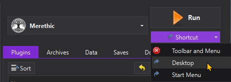
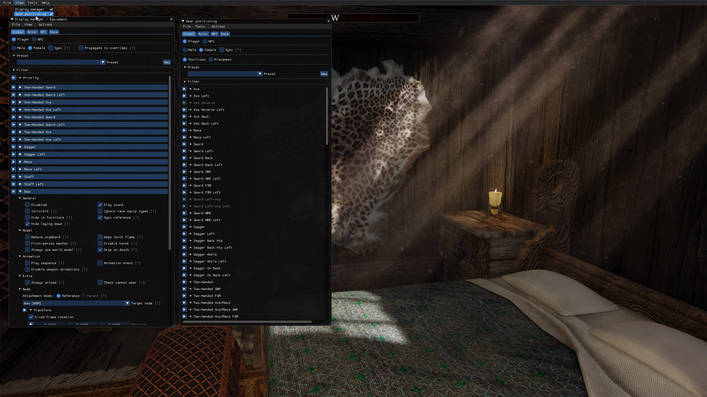
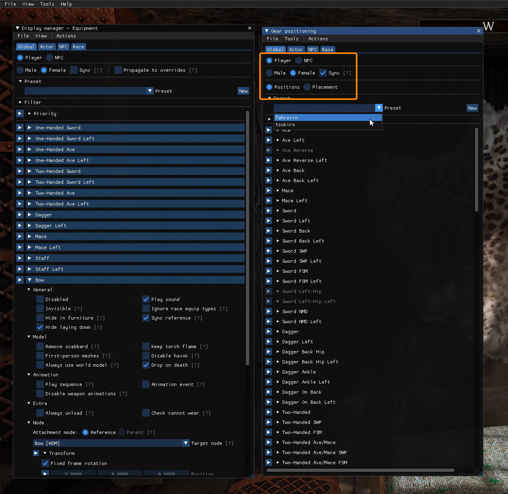
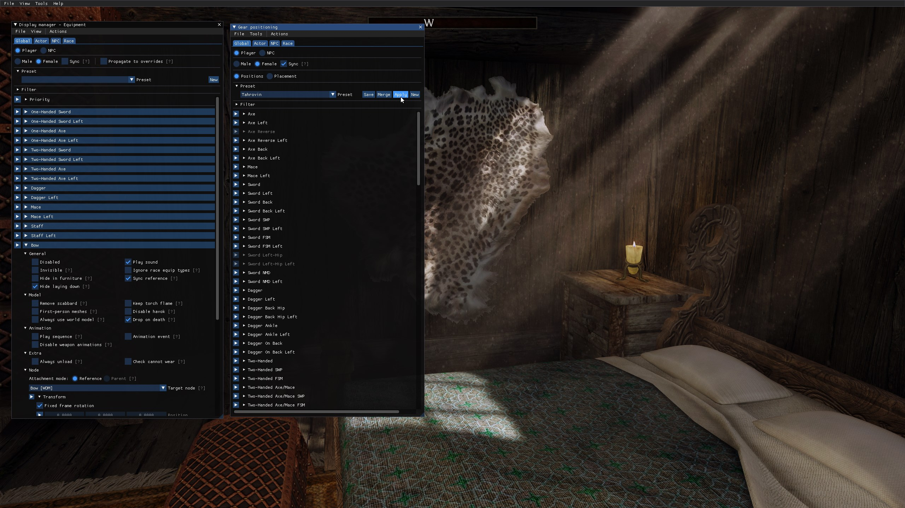

First things first: **this list contains adult content and you must be of legal age in your country. This means 18+ in most countries, 21+ in others. It is up to you to be sure of the age requirement in your country.**

# What is Merethic?
Merethic is a NSFW Skyrim modlist that aims to improve and add upon the Skyrim experience. It's a power fantasy list with new lands and new areas added to Skyrim to encourage exploring.

# Quick Links
:arrow_down: [All Manual Downloads](https://github.com/iAmMe27/Merethic/wiki)

:file_folder: [Known Problematic Downloads](ProblematicFiles.md)

:exclamation: [Common Issues](CommonIssues.md)

:wrench: [Advanced Extras - including Performance LODs](Advanced.md)

# Need Support?

# Contents
- [What is Merethic?](#what-is-merethic)
- [Quick Links](#quick-links)
- [Need Support?](#need-support)
- [Contents](#contents)
- [Preface](#preface)
- [Hardware Requirements](#hardware-requirements)
  - [Storage Space](#storage-space)
- [You Will Need](#you-will-need)
- [Pre-Installation](#pre-installation)
  - [Creation Club Content](#creation-club-content)
  - [Install Microsoft Visual C++ Redistributable Packages](#install-microsoft-visual-c-redistributable-packages)
  - [Setup your Antivirus](#setup-your-antivirus)
  - [Setup your Page File](#setup-your-page-file)
  - [Disable Steam Overlay](#disable-steam-overlay)
  - [Set game language to English](#set-game-language-to-english)
  - [Change Steam's Updating Behavior](#change-steams-updating-behavior)
- [Installation](#installation)
  - [Commonly Failing Downloads](#commonly-failing-downloads)
- [Post-Installation](#post-installation)
  - [Creating a desktop shortcut](#creating-a-desktop-shortcut)
- [Mod Setup](#mod-setup)
- [Updating Merethic](#updating-merethic)
- [Uninstalling Merethic](#uninstalling-merethic)

# Preface
Just to set some expectations and boundaries surrounding modlist development here, there's a couple things I'd like to say first.

1. As a modlist user, I expect some small efforts into fixing your own issues, mostly by searching the documentation provided here and by the Discord channels. It's very likely any issue you encounter has already been solved - if this is the case and it's well known, don't be surprised if you get ignored.
   
2. Support shouldn't be expected as instant - I have a full time job on top of this, as do my mod team, so I ask for a little bit of patience.
   
3. Do not expect a 100% polished, well-balanced and "perfect" experience. I am a 1-person dev team and expecting more from me than you would from AAA game studios is insanity.
   
4. We're modding a nearly 13 year old game here, please temper your expectations some.
   
5. I won't have a specific area for suggestions for mods to add. I have one for WoD and from what I've seen there and in other modlist situations is that people suggest mods that don't fit a lists theme or generally "bad" mods and then feel as if they're ignored or get annoyed when we say "won't add this".

# Hardware Requirements

|             | CPU                             | RAM                 | GPU                                             |
|-------------|---------------------------------|---------------------|-------------------------------------------------|
| Minimum     | Intel 7th Gen,  AMD 3000 Series | 16GB DDR4 @ 3000MHz | RTX 3070 (at least 8GB of VRAM) |
| Recommended | Intel 9th Gen, AMD 5800X        | 32GB DDR4 @ 3600MHz | RTX 4070                        |

## Storage Space

|             | Total Space   | Storage Type        |
|-------------|---------------|---------------------|
| Minimum     | 450GB         | SATA SSD            |
| Recommended | 600GB         | NVMe SSD            |

Your installation must be on an ***internal*** SSD. External SSDs & HDDs are too slow for modlists to run from.

# You Will Need
  * A Nexus Premium Account
  * A LoversLab Account
  * Patience

# Pre-Installation

**This stuff needs to be done BEFORE starting the Wabbajack installation.**

## Creation Club Content

>[!WARNING]
>Merethic requires all Creation Club content - **you need the $20 AE upgrade from Steam to install!**
>
>Remember to download all of it from the Creations menu in the vanilla game before starting the Wabbajack install.

## Install Microsoft Visual C++ Redistributable Packages
>[!CAUTION]
>MO2 and various SKSE mods need this - don't skip it.
>
>[Download Visual C++ Redistributable Package.](https://docs.microsoft.com/en-us/cpp/windows/latest-supported-vc-redist?view=msvc-170)

## Setup your Antivirus
Before you say "I don't have an antivirus" - you do, it's built into Windows. You *need* to exclude your Wabbajack folder and your Merethic installation folder from your antivirus' real-time protection stuff as it will interfere with your install. It can and will interfere whilst you are playing too, causing poor performance and obvious stuttering.

> [!TIP]
> How do I do this, you ask? [Click here to find out how.](https://support.microsoft.com/en-gb/windows/add-an-exclusion-to-windows-security-811816c0-4dfd-af4a-47e4-c301afe13b26)

If you use another antivirus program, refer to their steps for adding an exclusion.

***If you use Webroot, BitDefender, Norton or Kaspersky, I recommend you stop using these as these programs ***actively*** interfere with modlists even when they are excluded. Plus, you're wasting your money.***

## Setup your Page File
Skyrim modlists need a large amount of memory to allocate, even if you have large amounts of RAM. To setup your pagefile;

1. Hold down the *LEFT* Windows key and press **R**
2. Type in `systempropertiesadvanced` in the run box and then press ENTER
3. Under the "Performance" option, click the "Settings..." button
4. Switch to the "Advanced" tab
5. Under "Virtual Memory", click the "Change..." button
6. Uncheck `Automatically manage...` if it's checked
7. Select your *fastest* SSD in the list of drives
8. Check "Custom Size"
9. Set `Initial Size` to 20480
10. Set `Maximum Size` to 20480 also
    1.  *Note: you can set this up to 40000 if you have the space, this will let the pagefile expand to as large as 40GB*
11. Press the "Set" button
12. Press OK
13. Press APPLY and then OK
14. Restart your PC to apply the pagefile setting

## Disable Steam Overlay
The Steam overlay is known to cause issues, especially when using ENBs. Do so by heading into Steam, right clicking on Skyrim in your game library and clicking **Properties** > **General** > **Deselect "Enable Steam Overlay while in-game"**.

## Set game language to English
Wabbajack and some/most of the modding tools out there only support English language versions of Skyrim. Right click on Skyrim in your game library and click **Properties** > **Language** > **Select English**.

## Change Steam's Updating Behavior
Do this by right clicking on Skyrim in your game library and clicking **Properties** > **Updates** > **Change Automatic Updates to "Only update this game when I launch it"**. Whilst you're in here, it's also recommended to disable Steam Cloud too.

# Installation
Installing the list is straight forward, Wabbajack will do most of the heavy lifting for you - you only have to tell it where to put stuff.

Set the installation location to a folder on the root of a drive, something like `C:\Merethic`. Do not install it to one of the protected folders as mentioned earlier. The download location will have likely been filled in for you too - ensure it matches the directory you set for the installation location, or if you have multiple Skyrim modlists installed, use a common download folder - this will stop you from having to redownload common mods across multiple modlists.

>[!TIP]
>**I recommend you keep your downloads outside of the Merethic installation folder!** 
>
>It's best if you use a common folder for all of your Skyrim modlist downloads, to save repeatedly downloading the same mods over and over again.

## Commonly Failing Downloads
Downloads from non-Nexus file hosts often refuse to download automatically via Wabbajack for reasons. 

1. [All Manual Downloads are listed here.](https://github.com/iAmMe27/Merethic/wiki)
2. [All known problematic files are listed here.](ProblematicFiles.md)

Download these files and place them *as they are* into the Resource Download folder.

# Post-Installation
After Wabbajack has given you the installation successful screen, you're free to close it. Navigate to the Merethic installation folder and run MO2 by double-clicking `ModOrganizer.exe`.

>[!WARNING]
>**DO NOT UNDER ANY CIRCUMSTANCES RUN LOOT.**
> 
>The load order is exactly as intended out of the box and you do not need to change it.

## Creating a desktop shortcut
Open MO2, ensure **Merethic** is selected in the dropdown and click the "Shortcut" button. From the small dropdown menu, click "Desktop".

# Mod Setup
When starting a new game, create your character and once done, *DO NOTHING ELSE* and allow the mods to initialise.

1. Once initialised, open the MCM Config menu, navigate to the MCM Recorder menu and run `Part 1`. Play the recording and allow it to finish.
2. Save your game and reload.
3. Navigate to the same menu and run `Part 2`.
4. Save your game and reload.

**IED currently needs manual setup:**

Without the game paused, press `BACKSPACE` to open the IED menu and in the top menu bar, click `View` and then `Gear Nodes` to open the Gear Positioning menu.

In the Gear Nodes menu, ensure you are in the `Global` tab, with the `Player` option selected and then ensure `Sync` is ticked. Then from the `Preset` dropdown, select the `Merethic` preset.

Once selected, hit the `Apply` button and then click `OK` on the confirmation dialog box.

# Updating Merethic
When an update is released, please always check the [changelog](changelog.md) first. Backup your saves before you commit to any updates, Wabbajack doesn't usually touch save files, it does has the ability to delete them if it wanted to.

If you have added anything to this modlist at all, Wabbajack will also delete those. You should know how to stop it from doing this if you're going to add stuff to modlists.

# Uninstalling Merethic
Just delete the Merethic folder and it'll be gone.